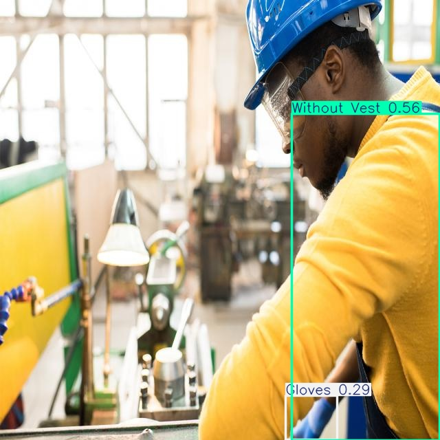
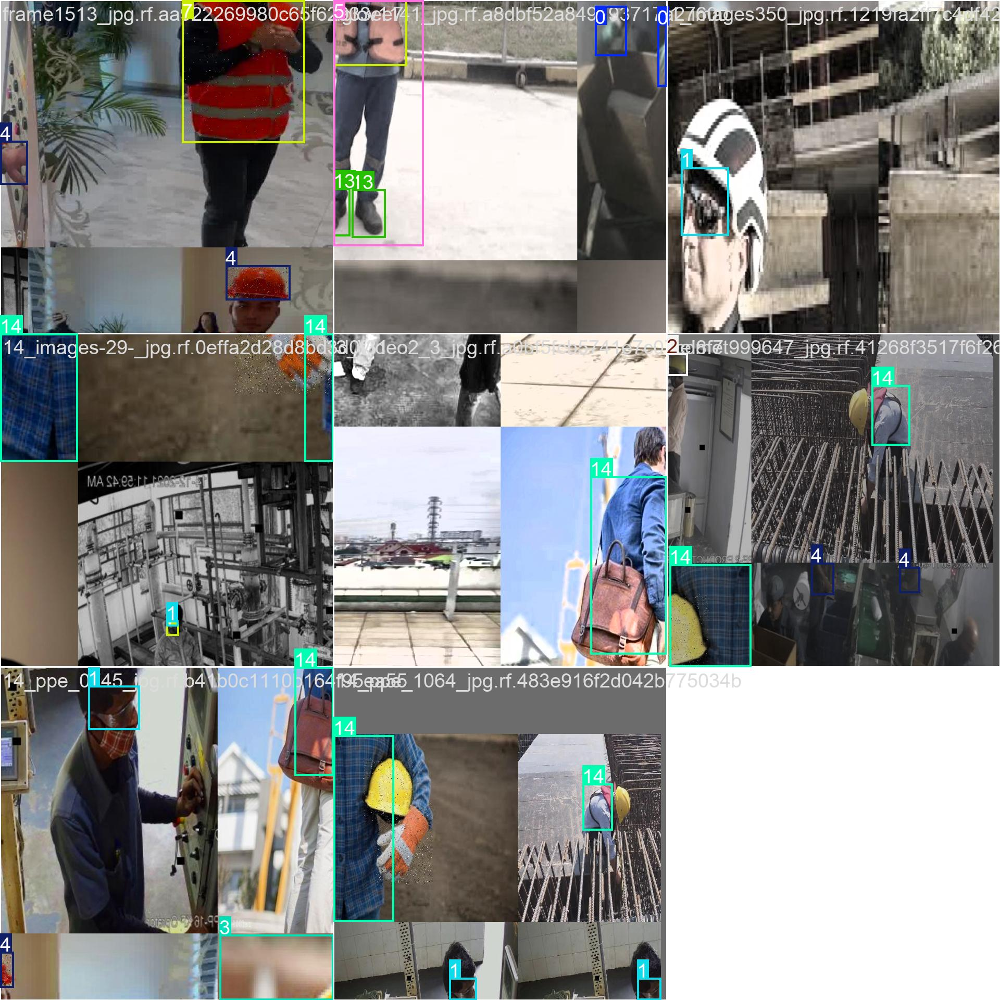
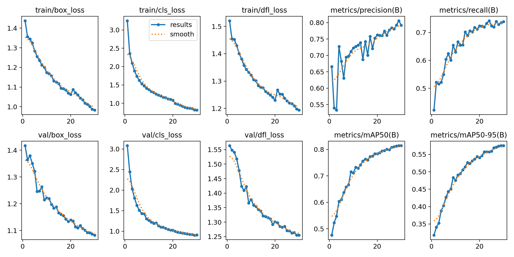
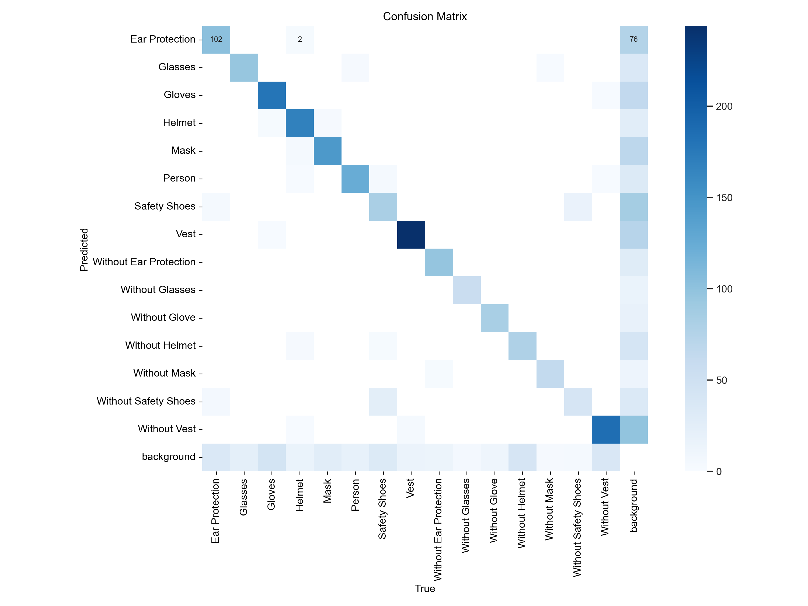

# Safety Wears YOLO - PPE Detection System

A computer vision system for automated Personal Protective Equipment (PPE) detection in industrial environments using a fine-tuned YOLOv8n model.

## 📋 Overview

This project implements a real-time PPE compliance monitoring system capable of detecting 15 safety-wear classes, including both compliance and non-compliance states. The model is optimized for deployment on edge devices and standard computing hardware.

## ✨ Features

- 🎯 **Multi-class Detection**: Identifies 15 safety-wear categories including helmets, vests, gloves, masks, safety shoes, ear protection, and glasses
- ✅ **Compliance Monitoring**: Detects both proper PPE usage and violations (e.g., "With Helmet" vs "Without Helmet")
- 📹 **Real-time Inference**: Supports live video streams via webcam or video files
- ⚡ **Lightweight Architecture**: YOLOv8n model optimized for edge deployment
- 🏭 **Production Ready**: Trained on combined datasets from multiple open-source sources

## 🦺 Detected Classes

The model detects the following 15 classes:
- 🎧 Ear Protection / Without Ear Protection
- 👓 Glasses / Without Glasses
- 🧤 Gloves / Without Glove
- ⛑️ Helmet / Without Helmet
- 😷 Mask / Without Mask
- 👢 Safety Shoes / Without Safety Shoes
- 🦺 Vest / Without Vest
- 👤 Person

## 📊 Detection Results

### Example Detection Output

**Original Image:**

**Detection Result:**

*Before and after comparison showing PPE detection results. The model successfully identifies safety equipment (gloves) and compliance violations (without vest) with confidence scores.*

### Real-time Inference

*A real-time demo was successfully tested using the laptop webcam. The model supports live video streams via webcam or video files for continuous PPE compliance monitoring.*

## 🚀 Model Training

- 🏗️ **Architecture**: YOLOv8n (nano variant)
- 📚 **Training Data**: Combined dataset from multiple open-source PPE datasets (primarily Roboflow). The dataset merges annotations from different sources to create a generalized training set.
- 🖼️ **Training Method**: Training was performed offline on static images, not CCTV footage. The trained YOLOv8n model works with both single images and live video.
- 📊 **Dataset Split**: Train/Validation/Test split with 7,772 training images, 971 validation images, and 984 test images
- 🖥️ **Image Resolution**: 640x640 pixels
- 💡 **Note**: The model can be significantly improved by adding real images from your specific deployment environment (same cameras, environment, lighting, workers). Model performance can be enhanced by incorporating domain-specific images matching your deployment environment.

### 📈 Training Metrics

*Training curves showing loss, precision, recall, and mAP metrics*

*Confusion matrix showing per-class detection performance*

## 📦 Requirements

- 🐍 Python 3.8+
- 🔬 Ultralytics YOLOv8
- 📷 OpenCV
- 🔥 PyTorch

## 💻 Usage

Training and inference scripts are provided in the project. Use `train.py` for model training and the scripts in `final_result/` for inference on images and video streams.

## 🌐 Deployment

The model is suitable for deployment on:

- 💻 **Standard Computers**: CPU or GPU-based inference
- 🍓 **Edge Devices**: Raspberry Pi (with optional Google Coral TPU for enhanced performance)
- 🏢 **Production Environments**: CCTV systems and monitoring stations

No GPU is strictly required for inference, but it significantly boosts processing speed. GPU acceleration is recommended for optimal performance.

## 📁 Project Structure

The project contains training scripts, dataset configuration files, and inference utilities. The trained model weights are located in `final_result/train22/weights/`.

## 📄 License

This project utilizes open-source datasets and the Ultralytics YOLOv8 framework.
